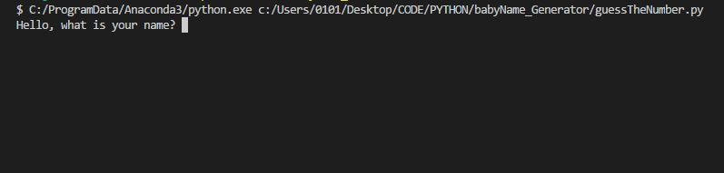

# Guess TheNumber Game (Python)

## Description

This very simple Python game illustrates how simple is to [import](https://docs.python.org/3/reference/import.html) built in methods, assign a value to a [variable](https://www.learnpython.org/en/Variables_and_Types), check its value using [if statements](https://docs.python.org/3/tutorial/controlflow.html), and using [try except](https://docs.python.org/3/tutorial/errors.html) to detect input errors and notify the user of the correct game parameters.    

## Anaconda Installation

Go to Anaconda's Site and select your OS

    https://www.anaconda.com/download/

Install Anaconda using this [guide](https://docs.anaconda.com/anaconda/install/)

Use your IDE of choice with Anaconda's env.

* [Pycharm](https://www.jetbrains.com/pycharm/)

* [VSCode](https://code.visualstudio.com/), with [Python Extension](https://marketplace.visualstudio.com/items?itemName=ms-python.python)

* etc.

## Demo
The game starts by asking the user's name

Then, it asks if the user wants to play the game

If the user doesn't want to play the game, the game script ends

If the user does want to play the game, the game script continues while looping through the script and checking for condition win == false or win == true.

If the user tries to input an incorrect value type, the game will let the user know

Otherwise, it will continue running until win == true

## Installation

To run the application locally, first clone this repository with the following command.

	git clone https://github.com/miguelaw/Python-GuessTheNumberGame.git
	
Access to the project's folder

	cd Python-GuessTheNumberGame

Finally, run the Python file in the terminal / console.

	../Python-GuessTheNumberGame/guessTheNumber
	

**Thank you for checking out our work!**
